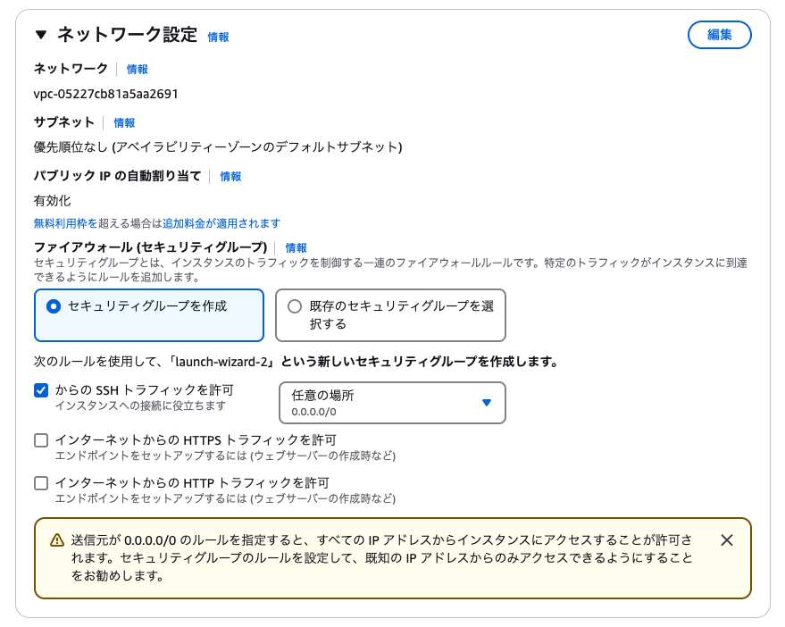
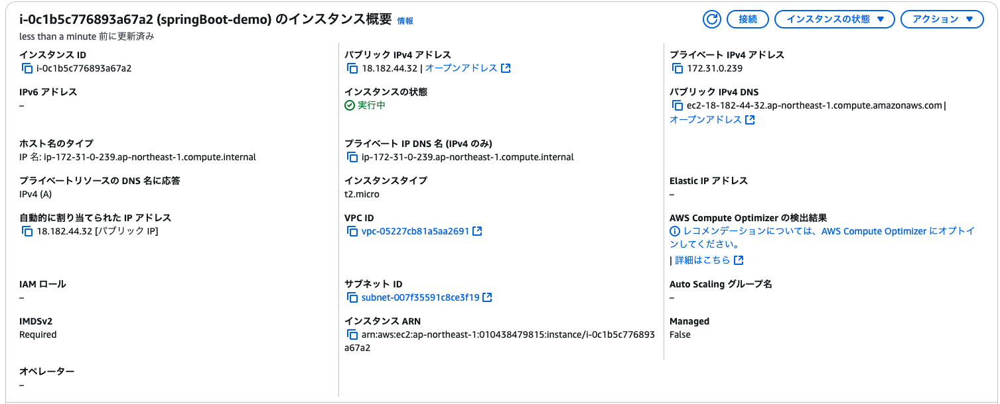

# AWSでローンチする手順

## 1.EC2インスタンスの作成
①.AMIでAmazon Linux 2 など適切なLinuxディストリビューションを選択
②.インスタンスに対してSSH接続接続を固化するセキュリティグループ作成 ポート22
③.AuroraDB接続用のセキュリティグループ  ポート3306
④.インスタンス接続用キーペアの作成


## 2.AuroraDB作成
①.Mysqlで作成する
②.DB名・ユーザー名・パスワード設定
③.セキュリティグループ作成 EC2インスタンス側で作成したセキュリティグループを指定
④.上記の値をapplication.propertiesに追記

## 3.EC2インスタンスに対するwarファイルのデプロイ
①.1-4で作成したキーペアを使用してEC2インスタンスに接続確認
②.warファイルをEC2インスタンスにデプロイ(webapps配下)
③.tomcatを起動 (/opt/tomcat/bin/startup.sh ) ※systemcdの設定ファイルを作成し、Tomcatの自動起動などするのが良い


# 上記を踏まえた上での最小構成
①.EC2作る パブリックアクセスOK状態で.
「セキュリティグループを作成する」に設定すると、自動的にSSH接続ですべてのIPからのアクセスを許可してくれる
この結果、パブリックなIPアドレスを生成してくれる


EC2インスタンスの設定画面で、接続可能なIPアドレスを確認可能となる。
項目は「パブリック IPv4 DNS」の部分


以上の手順で springBoot-demo というEcC2インスタンスを作成

②.キーを使用してEC2インスタンスにアクセス
上記の画像の場合は、以下のコマンドとなる。pemファイルの指定を忘れないこと

**接続コマンド**
```
 ssh -i /Users/ts/.ssh/springBoot-demo-key.pem ec2-user@ec2-18-182-44-32.ap-northeast-1.compute.amazonaws.com
```

③.java17をインストール
ROOTユーザーに切り替えてjavaをインストールする<br>
  →ROOTユーザーのパスワードは**「setu1657」**とした

**ROOTユーザに切り替えるコマンド**
```
sudo su -
```

**インストール可能なjavaList**
```
sudo dnf list --available "java-*"
```

**17のインストール**
複数リストに表示されるが、XXX_devel(JDKに当たる)をインストールすること.ちなみにdevelがないのはJREのこと
```
sudo dnf -y install java-17-amazon-corretto-devel
```

**version確認**
```
java -version
```
**パス設定**
java17は 「usr/lib/jvm」配下にインストールされている
```
sudo find /usr/lib -name "java-17-amazon-corretto"
/usr/lib/jvm/java-17-amazon-corretto
```

javaのパスを通す
```
export JAVA_HOME=/usr/lib/jvm/java-17-amazon-corretto
export PATH=$PATH:$JAVA_HOME/bin
以下で適用
source /home/ec2-user/.bashrc 
パスの確認
echo $JAVA_HOME
```


④.Tomcatをインストール

home配下のbashファイルにパスを設定するところから再開
以下の内容を末尾に追記する(Tomcatの環境変数、DB接続の環境変数の設定)
の↓部分
https://qiita.com/puchanko/items/b36c5dedae568280f645

⑤.mysqlをインストール


⑥.warファイルをアップする